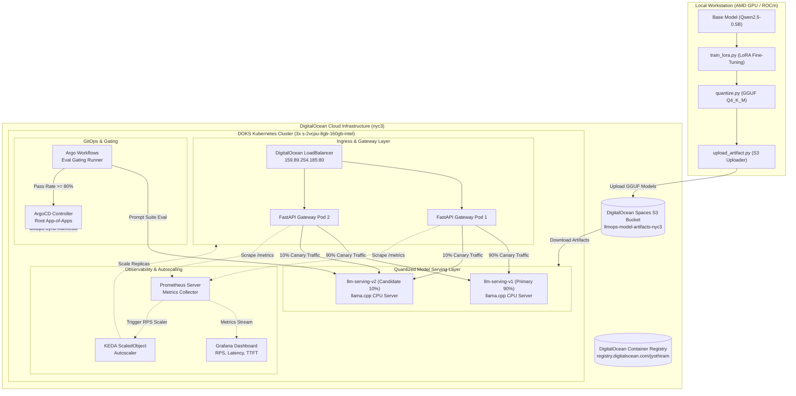

# Hybrid LLMOps Platform (Local GPU Fine-Tuning + DOKS Serving)

A portfolio-grade LLMOps platform demonstrating end-to-end lifecycle management of a small language model: fine-tuning on local AMD GPU hardware (ROCm), GGUF quantization, CPU-based serving on a resource-constrained Kubernetes cluster (DigitalOcean Kubernetes - DOKS), GitOps deployment, automated evaluation gating, canary rollout between model versions, KEDA autoscaling, and Prometheus/Grafana observability.

---

## 1. Architecture



---

## 2. Cluster Resource Allocation Analysis

The cluster operates under a strict budget of 3 DigitalOcean worker nodes (`s-2vcpu-8gb`), totaling **6 vCPU / 24 GiB RAM**.

| Component | Pod Replicas | CPU Request / Limit | Memory Request / Limit | Total CPU Allocation | Total RAM Allocation |
|---|---|---|---|---|---|
| **llama.cpp Server (v1 Primary)** | 1 | 1.0 vCPU / 1.5 vCPU | 2.0 GiB / 3.0 GiB | 1.0 vCPU | 2.0 GiB |
| **llama.cpp Server (v2 Candidate)** | 1 | 1.0 vCPU / 1.5 vCPU | 2.0 GiB / 3.0 GiB | 1.0 vCPU | 2.0 GiB |
| **FastAPI Gateway** | 2 | 250m / 500m | 256 MiB / 512 MiB | 0.5 vCPU | 0.5 GiB |
| **Prometheus & Grafana** | 1 | 250m / 500m | 512 MiB / 1.0 GiB | 0.25 vCPU | 0.5 GiB |
| **KEDA & System Components** | - | 500m / 1.0 vCPU | 1.0 GiB / 2.0 GiB | 0.5 vCPU | 1.0 GiB |
| **Workflow Burst Headroom** | 1 (ephemeral) | 1.0 vCPU / 1.0 vCPU | 1.0 GiB / 2.0 GiB | 1.0 vCPU | 1.0 GiB |
| **TOTAL** | - | - | - | **4.25 / 6.0 vCPU (70.8%)** | **7.0 / 24.0 GiB (29.1%)** |

---

## 3. Quick Start & Reproduction Guide

### Prerequisites
- `terraform` >= 1.3.0
- `kubectl` & `helm`
- `python3` (with `torch`, `transformers`, `peft`, `boto3`)
- `k6` load testing tool
- DigitalOcean API Token & Spaces Access Keys

### Step 1: Provision Infrastructure with Terraform
```bash
cd terraform
export TF_VAR_do_token="your-digitalocean-api-token"
terraform init
terraform apply -auto-approve
```

### Step 2: Local GPU Fine-Tuning & Quantization Pipeline
Configure ROCm environment variables for local AMD GPU execution:
```bash
export HSA_OVERRIDE_GFX_VERSION=10.3.0

# 1. Fine-tune base model with LoRA
python training/train_lora.py --base_model Qwen/Qwen2.5-0.5B-Instruct --output_dir ./checkpoints/v1.0.0

# 2. Quantize to GGUF Q4_K_M format
python training/quantize.py --model_dir ./checkpoints/v1.0.0 --output_dir ./quantized --version v1.0.0

# 3. Upload model artifact to DigitalOcean Spaces
export SPACES_ACCESS_KEY_ID="your-access-key"
export SPACES_SECRET_ACCESS_KEY="your-secret-key"
python training/upload_artifact.py --model_file ./quantized/model-v1.0.0-q4_k_m.gguf --version v1.0.0
```

### Step 3: Deploy GitOps & ArgoCD App-of-Apps
```bash
# Apply ArgoCD root application
kubectl apply -f gitops/root-application.yaml
```

### Step 4: Run Automated Model Evaluation & Gating Pipeline
```bash
# Execute evaluation suite against candidate model endpoint
python eval/eval_runner.py --endpoint http://llm-serving-v2:8080 --model_version v2.0.0 --threshold 0.80

# If evaluation passes threshold (>= 80%), promote candidate to canary split:
./workflows/promote_candidate.sh v2.0.0
```

### Step 5: Test KEDA Autoscaling Under Load
Run `k6` load generator script against Gateway endpoint:
```bash
k6 run manifests/keda/k6-load-test.js -e GATEWAY_URL="http://<GATEWAY_LOADBALANCER_IP>"
```

Monitor gateway pod scale-up:
```bash
kubectl get pods -l app=llm-gateway -w
```

---

## 4. Key Engineering Trade-offs & Case Study

1. **llama.cpp Server vs. Ollama / vLLM:**
   - *Choice:* `llama.cpp` server binary.
   - *Rationale:* Ollama adds operational overhead and container bloat. vLLM requires heavy GPU memory allocation not feasible on CPU DOKS nodes. `llama.cpp` server provides ultra-low memory footprint (~2GiB RAM) and direct GGUF CPU vector acceleration.

2. **Canary Traffic Splitting in Gateway:**
   - *Choice:* Dynamic weight-based canary split in FastAPI application layer rather than Service Mesh (Istio/Linkerd).
   - *Rationale:* Eliminates Service Mesh sidecar resource overhead (~500MB RAM / pod), saving precious RAM for model serving.

3. **Deterministic Evaluation Gating:**
   - *Choice:* Keyword/regex prompt evaluation suite executed via Argo Workflows.
   - *Rationale:* Avoids expensive external LLM-as-a-judge API costs while providing deterministic, repeatable pass/fail gating in CI/CD.
